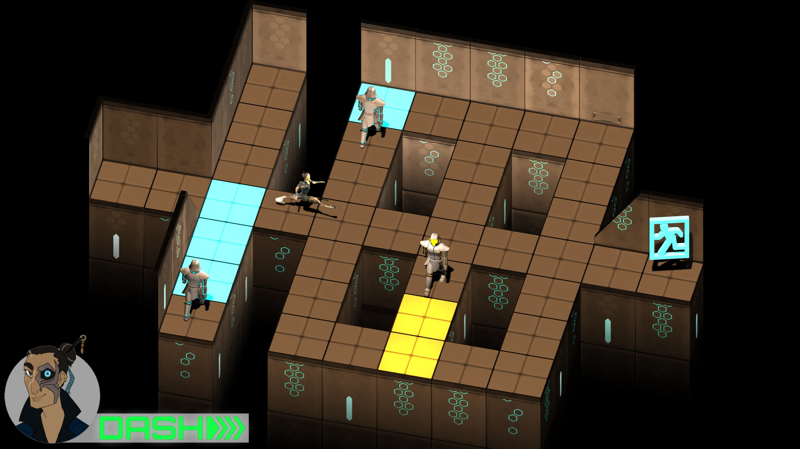

# eVasion

This was the final assessment for my first year at AIE. We were assigned a group and given 6 weeks to create a game. I was one of the two programmers in the group and had a hand in programming everything from the menus, player HUD, enemy AI, player movement, and music.

eVasion is a top-down turn based stealth game, where the protagonist must use his unique skill set to steal a time travel device from the corrupt government.

You can download the Windows build following the link below.

https://strongishllama.itch.io/evasion
